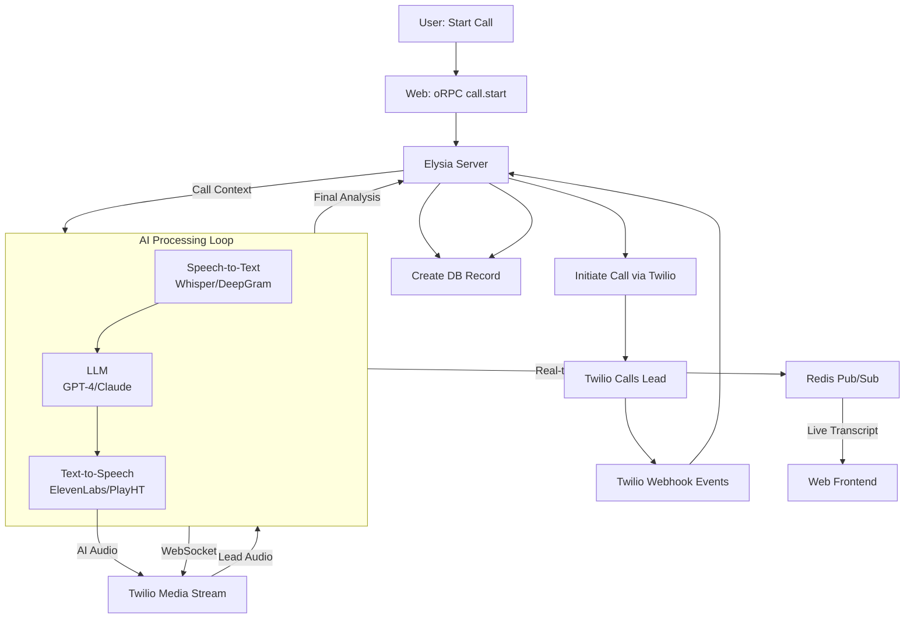

# Yaalp Project Structure

## Directory Structure

note: some files are not shown for simplicity.

```plaintext
sales-agent-app/
├── apps/
│   ├── web/                 # Next.js Frontend (App Router)
│   │   ├── src/
│   │   │   ├── app/         # App router pages (dashboard, settings, calls)
│   │   │   ├── components/  # Reusable UI components (using shadcn/ui)
│   │   │   ├── lib/         # Frontend utilities, API clients (oRPC)
│   │   │   └── styles/      # Global TailwindCSS styles
│   │   └── package.json
│   │
│   └── server/              # Main API Server (Elysia + oRPC)
│       ├── src/
│       │   ├── lib/         # Database client (Drizzle), Elysia app instance
│       │   ├── modules/     # Feature-based modules (Auth, Users, Agents, Calls, Leads)
│       │   ├── routes/      # HTTP Routes (if not purely oRPC)
│       │   └── index.ts     # Server entry point
│       └── package.json
│
├── packages/
│   ├── ai-worker/           # Dedicated AI Processing Service
│   │   ├── src/
│   │   │   ├── lib/         # AI clients (OpenAI, Replicate, ElevenLabs)
│   │   │   ├── tasks/       # Individual AI tasks (transcribe, analyze, generate)
│   │   │   └── index.ts     # Worker entry point (runs on a Cloudflare Worker/VPS)
│   │   └── package.json
│   │
│   ├── database/            # Shared Database Package
│   │   ├── src/
│   │   │   ├── schema/      # Drizzle schema definitions (Users, Leads, Calls, etc.)
│   │   │   └── index.ts     # Drizzle client instance
│   │   └── package.json
│   │
│   ├── types/               # Shared TypeScript types
│   │   └── package.json
│   │
│   └── oprc/                # oRPC API definition and routers
│       ├── src/
│       │   └── routers/     # Exported oRPC routers from the server
│       └── package.json
│
├── package.json (workspace root)
├── turbo.json              # Turborepo build pipeline
└── docker-compose.yml      # For local PostgreSQL & Redis
```



### Key Characteristics

- **Type Safety**: End-to-end type safety via orpc and Drizzle ORM
- **Local/Remote Dual Mode**: PGLite enables user data
